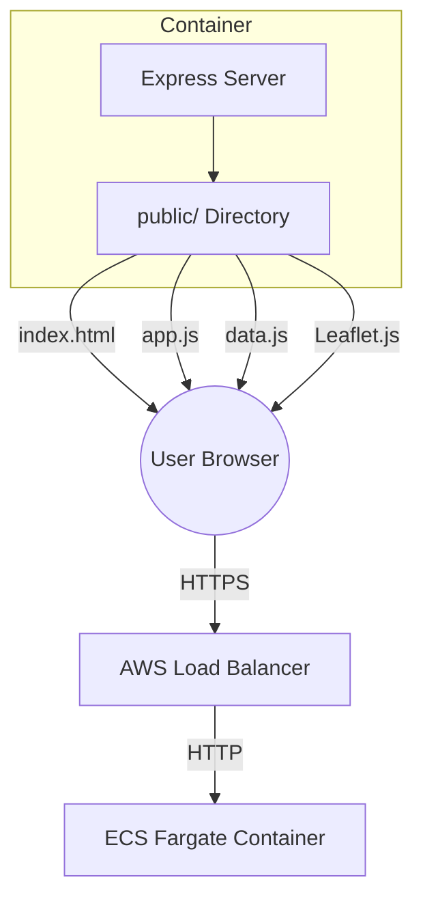

# System Architecture — Yamnaya Migration Map

This document describes the technical architecture, data models, and design decisions of the Yamnaya Migration Map.

## Overview
The Yamnaya Migration Map is an interactive web application that visualises the spread of Proto-Indo-European (PIE) languages and associated genetic migrations from approximately 4000 BCE to 500 CE. 

**Design Philosophy:**
- **Zero Build Complexity:** No bundlers, transpilers, or complex frontend frameworks. Standard ES2020 JavaScript runs directly in modern browsers.
- **Data-Driven:** All historical content is decoupled into a single schema-validated JSON-like object (`PIE_DATA`).
- **Performance First:** Heavy use of `requestAnimationFrame` for smooth 60fps animations and Express-level compression for data delivery.
- **Privacy & Security by Design:** GDPR-compliant anonymized logging and restrictive Content Security Policies.

## Tech Stack

| Component | Technology | Version | Purpose |
|---|---|---|---|
| **Runtime** | Node.js (Alpine) | 20.x | Server environment |
| **Server Framework**| Express | 4.18.2 | Static file serving & middleware |
| **Security** | Helmet | 8.1.0 | HTTP security headers (CSP, HSTS, etc.) |
| **Rate Limiting** | express-rate-limit | 8.3.2 | Brute-force and DoS protection |
| **Logging** | Morgan | 1.10.1 | Request logging with IP anonymization |
| **Compression** | Compression | 1.8.1 | Gzip/Brotli for static assets |
| **Map Engine** | Leaflet.js | 1.9.4 | Map rendering, projections, and interaction |
| **Frontend** | Vanilla JavaScript | ES2020 | Application logic (PIEMigrationMap class) |
| **Styling** | Vanilla CSS | 3 | Dark-themed UI and timeline controls |
| **Containerization**| Docker | - | Multi-stage production builds |
| **Infrastructure** | AWS Fargate | - | Primary production deployment target |

## Repository Structure

```
proto-pie-map/
├── server.js            # Express server configuration & middleware stack
├── package.json         # Node.js dependencies and start scripts
├── Dockerfile           # Multi-stage build (deps → runtime, non-root user)
├── docker-compose.yml   # Local development container orchestration
├── CLAUDE.md            # Developer quick-reference guide
├── README.md            # User-facing installation and usage guide
├── docs/                # Comprehensive documentation
│   ├── ARCHITECTURE.md  # This file
│   ├── DEPLOYMENT.md    # AWS Fargate & CI/CD instructions
│   ├── ROADMAP.md       # Feature backlog and research gaps
│   └── SECURITY.md      # Vulnerability analysis and mitigations
└── public/              # All static assets served to the browser
    ├── index.html       # Main application shell and UI declarations
    ├── style.css        # Layout, typography, and dark-theme aesthetics
    ├── data.js          # Historical dataset (PIE_DATA global object)
    ├── app.js           # Core PIEMigrationMap application class
    ├── lib/             # Vendored third-party libraries (Leaflet)
    └── privacy.html     # GDPR and privacy information
```

## System Architecture

The application follows a simple Static Server + Heavy Client architecture.



**Request Lifecycle:**
1. **Initial Load:** Browser requests `/`. Express serves `public/index.html`.
2. **Asset Fetch:** Browser parses HTML and fetches `lib/leaflet.js`, `data.js`, `style.css`, and `app.js` in parallel.
3. **Bootstrapping:** `app.js` instantiates the `PIEMigrationMap` class, passing in `PIE_DATA`.
4. **Map Init:** Leaflet initializes the map container and fetches raster tiles from defined providers (CartoDB, OpenTopoMap, etc.).
5. **Animation:** The application enters a `requestAnimationFrame` loop, interpolating culture positions and migration path lengths based on the current `timelineYear`.

## Frontend Architecture

### PIEMigrationMap Class
The entire application logic resides in a single ES6 class. Key components include:

- **Constructor:** Sets up initial state (year, speed, opacity, visibility) and parses URL hash parameters.
- **Initialization Sequence:** `initMap()` -> `buildLegend()` -> `initControls()` -> `initSites()` -> `renderYear()`.
- **Render Loop (`animationLoop`):** Uses `requestAnimationFrame` to calculate the delta-time and increment the `currentYear` based on selected playback speed.
- **State Management:**
    - **Timeline:** Managed via a range slider and playback controls.
    - **URL State:** Debounced hash updates (`#year=-2000&hidden=tocharian&sites=0`) allow for deep-linking.
    - **Visibility:** A branch-level visibility map (`branchVisible`) toggles entire language families.

### Data Flow
`PIE_DATA` (Global) → `renderYear(year)` → `updateTerritories(year)` + `updateMigrations(year)`

- **Territories:** Each culture in `PIE_DATA` is processed. If active for the year, its center and radius are interpolated, and a `L.circle` (or `L.polygon` for ellipses) is updated or created.
- **Migrations:** Migration paths calculate "drawing" progress between `animateStart` and `animateEnd` years, updating the visible segment of a dashed `L.polyline`.

## Data Architecture

### PIE_DATA Schema
The dataset is structured as a single object with the following main keys:
- **`branches`:** Mapping of language families to display names and hex colors.
- **`cultures`:** Array of historical entities. Each includes `phases` (keyframes) for position/size interpolation and `admixture` data for genetic visualization.
- **`migrations`:** Geographic paths (`[lat, lon]` waypoints) with visibility and animation timing windows.
- **`events`:** Discrete historical milestones shown in the "Ticker" panel.
- **`genetics`:** Narrative descriptions of ancient DNA findings per branch.
- **`sites`:** Specific archaeological excavation points.

### Interpolation Model
The engine uses **Linear Interpolation (lerp)** between keyframes in a culture's `phases` array.
- **Center:** Lerped latitude and longitude.
- **Radius:** Lerped km radius (converted to meters for Leaflet).
- **Ellipse Axes:** Lerped `rx` and `ry` semi-axes for non-circular territories.

### Coordinate System
- **Geographic:** WGS84 decimal degrees `[lat, lon]`.
- **Distance:** Radii and semi-axes provided in Kilometres; converted to Metres at runtime for `L.circle`.

## Backend / Server Architecture

The Express server acts as a hardened static file server.

- **Middleware Stack:**
    - **Helmet:** Sets 11+ security headers, including a strict Content Security Policy (CSP).
    - **Morgan:** Logs requests in "combined" format but uses a custom `anonymizeIp` token to zero out the last octet of IPv4/IPv6 addresses for GDPR compliance.
    - **Compression:** Compresses all text-based responses (reduces `data.js` from ~70KB to ~18KB).
    - **Rate Limit:** Restricts IPs to 300 requests per 15 minutes to prevent scraping and DoS.
- **Static Serving:** Serves the `/public` folder with `etag` support and a 1-day `maxAge` cache header in production.

## Infrastructure

### Docker
- **Multi-stage Build:** 
    - `deps` stage installs production dependencies only.
    - `runtime` stage uses a slim Alpine base, copies only necessary files, and runs as a non-root `appuser`.
- **Healthcheck:** Built-in `wget` check ensures the container is serving requests on port 3000.

### Deployment & CI/CD
- **GitHub Actions:** Automatically builds the Docker image on push, runs security audits (`npm audit`), and pushes to Amazon ECR.
- **AWS Fargate:** Serverless container execution. Traffic is routed via an Application Load Balancer (ALB) which terminates TLS.
- **GitHub Pages:** Supported as a secondary target for the frontend assets (using the `<meta>` tag CSP fallback).

## Security Architecture

- **Content Security Policy (CSP):** 
    - `default-src 'self'`: Disallows all external resources by default.
    - `script-src 'self'`: Only allows scripts from the same origin (no inline JS).
    - `img-src`: Whitelists specific tile providers (CartoDB, ESRI, OpenTopoMap).
- **DOM Safety:** The application uses a `escapeHTML` helper and `textContent` to prevent XSS when rendering data-driven labels and descriptions.
- **Infrastructure Hardening:**
    - `readonlyRootFilesystem` enabled in ECS task definitions.
    - Security Groups restrict container access to the Load Balancer only.

## Design Decisions

| Decision | Rationale |
|---|---|
| **Leaflet over D3** | Leaflet provides superior out-of-the-box tile management, zoom handling, and geographic projection. D3 is more powerful for custom SVG shapes but requires significantly more boilerplate for map-based interactions. |
| **No Frontend Framework** | The UI is mostly static overlays on a map. React or Vue would add build-time complexity and bundle size without providing meaningful benefit for this specific use case. |
| **L.circle over GeoJSON** | Defining historical boundaries as precise GeoJSON polygons is impossible for 4000 BCE. Using a center + radius (interpolated) provides a "fuzzy" boundary that more accurately reflects archaeological uncertainty. |
| **Linear Interpolation** | Spline or easing-based interpolation would create smoother movement but adds mathematical complexity. Given the 100-year resolution of most data points, linear interpolation is visually sufficient. |
| **setOpacity() for Dimming** | Early versions used CSS `filter: brightness()` on the map. This dimmed labels and borders on the tiles themselves. Using `tileLayer.setOpacity()` allows the tiles to blend with the background while keeping label text crisp. |

## Known Gaps & Roadmap

- **Research:** Missing major pre-PIE layers (WHG, EHG, ANF) and some specific branches (Baltic, Slavic expansion).
- **Features:**
    - Mobile-responsive layout (currently optimized for desktop).
    - Phlyogenetic language tree visualization.
    - Ancient DNA individual sample overlay.
- **Performance:** Potential for viewport culling if the `cultures` array grows beyond 100+ entities.

*See [ROADMAP.md](./ROADMAP.md) for a full prioritized backlog.*
